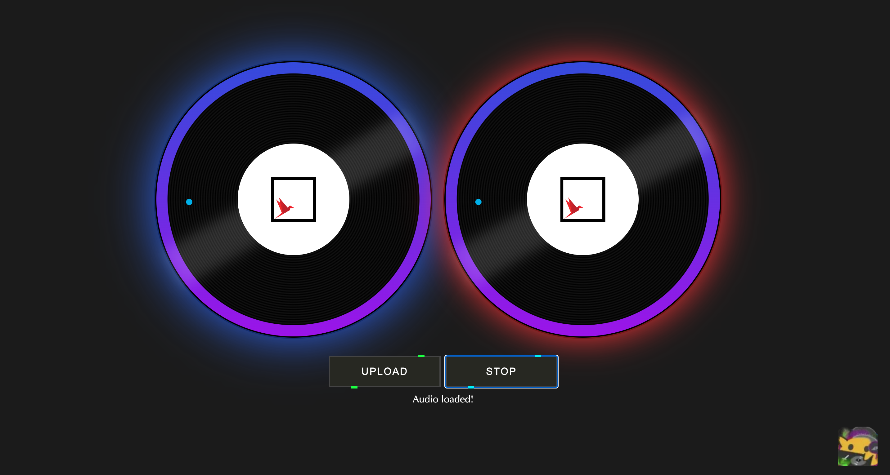

# Attack of the Zip

*Disclaimer: This repository is intended for demonstration and education purposes only. The author does not assume any responsibility for the potential misuse of techniques presented herein.*

This repository contains several Docker containers hosting web instances vulnerable to zip attacks. (Relevant blog post incoming.)

<!-- TODO: link -->

## Overview

There are currently two containers to play with.

1. `01-playground`. This is a simplified playground with a basic upload interface and codebase for testing various zip payloads. **New 'players' are recommended to start here!**
2. `02-juice`. This is the original challenge for Firebird CTF 2024; complete with slick DJ interface, slightly more complex codebase, and slightly stronger defenses.
    

These containers host a C++ web application built with the Drogon web framework and the Juce audio processing library (v6.1.4) for unzipping files. This was adapted from a recent web challenge I designed for HKUST Firebird CTF 2024. In the original challenge, Juce was used for audio synthesis. But to keep things simple, I've minimised the code to only unzip files—a mere shell of its former glory.


## Building

1. [Get Docker](https://docs.docker.com/get-docker/).

2. Build the containers. `cd` to the appropriate directory and run `docker compose`.

    ```sh
    # Example
    cd 01-playground
    docker compose up -d --build
    ```

    Grab a drink while waiting for the container to compile and build.

3. Access the container at http://localhost:8080.

4. Debug the container state by (1) opening Docker Desktop and navigating to the container's terminal OR (2) by using [`docker exec -it`](https://stackoverflow.com/a/30173220/10239789).
    - This is useful when you want to figure out what was unzipped. Or what location your file was unzipped to.


## Usage

1. Upload a file.
2. ???
3. Try to read `/app/flag.txt`.

Good luck.

## Challenges

Exercises for the reader!

### The Basics

Some guiding questions for `01-playground`.

- Drogon will load configuration options from ______ (which file?).
- Static files are served from ______ (which directory?).
- Explore the source code in `src/main.cpp`. What endpoints exist?

### Challenge 1: `playground`

1. Exploit the app with a directory traversal and null-byte injection to read `/app/flag.txt`.
    1. Which line(s) of code is/are to blame for this vulnerability?
    2. Suggest one check to guard against a null-byte injection.
2. Exploit the app with a [zip symlink attack](https://trebledj.me/posts/attack-of-the-zip/#zip-symlink-attacks) to read `/app/flag.txt`.
    - How many different payloads can you find? (There are at least 3.)
    - Here, "different" means the structure of the zip (and perhaps other things) are significantly different. Simply changing the filename or adding directories isn't considered *different*.


### Challenge 2: `juice`

Things are a lot more challenging!

The app now guards against null-byte injection in the `/audio` endpoint. More scarily, it also adds a suffix to any unzipped file, so that...

```text
app/
└── uploads/
    └── a731c562f49d948e7ebbaa8749f6cb96/
        └── evil.mscz/
            └── foo.txt
```

unzipped becomes...

```text
app/
└── uploads/
    └── a731c562f49d948e7ebbaa8749f6cb96/
        └── evil.mscz/
            └── foo.txt
        └── foo_a731c562f49d948e7ebbaa8749f6cb96.txt
```

where `foo_a731c562f49d948e7ebbaa8749f6cb96.txt` is the unzipped file with the added suffix.

1. Exploit the app with directory traversal and a [zip symlink attack](https://trebledj.me/posts/attack-of-the-zip/#zip-symlink-attacks).
    - (You may need to rely on other hidden mechanisms. By hidden, I mean not in the code. Google is your friend.)
2. You can still try the other zip symlink attacks to read `/app/flag.txt`.
    - If you figured out multiple payloads... which ones work and which don't?
    - Why do they not work now?
